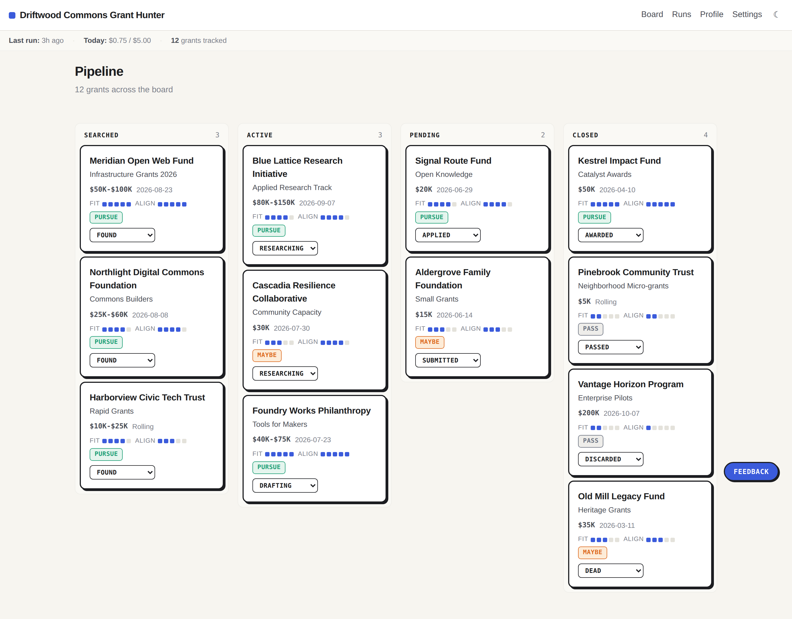
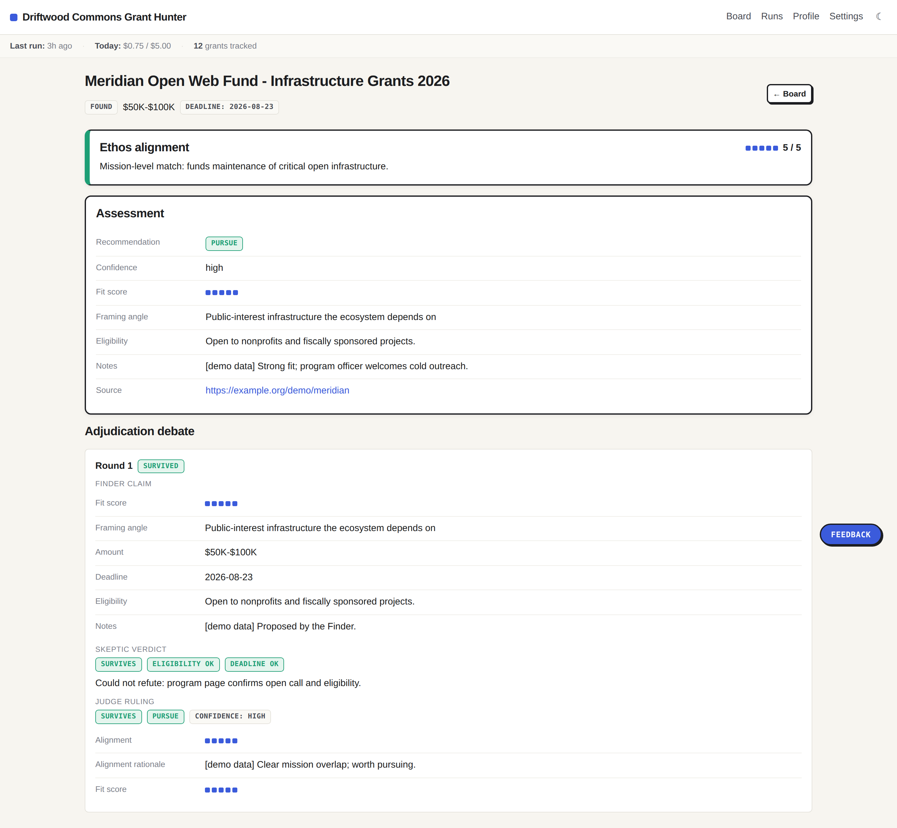
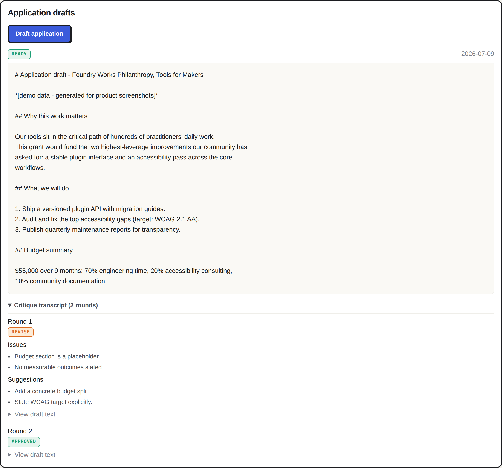
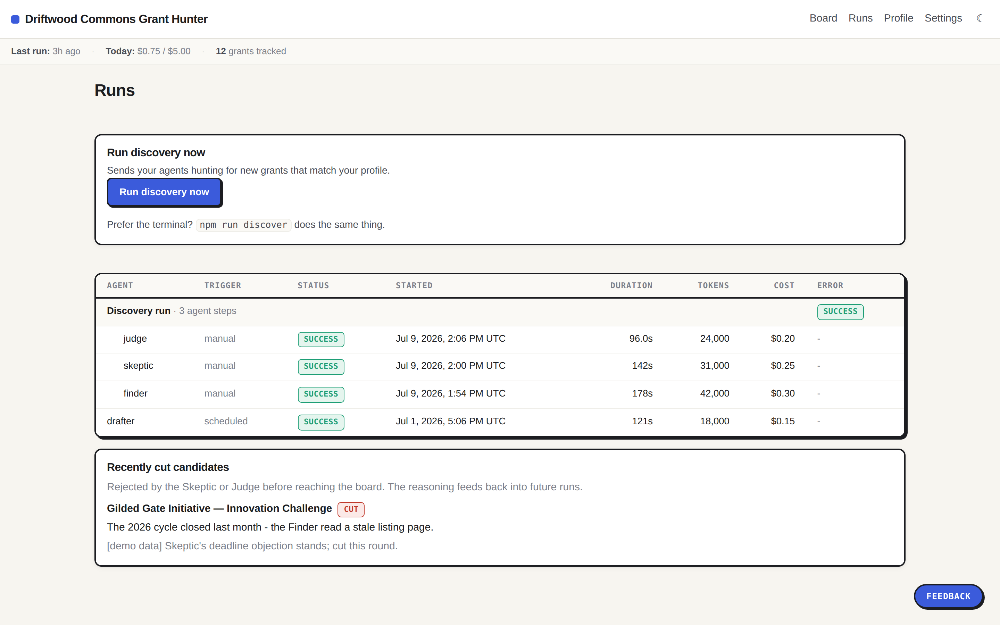
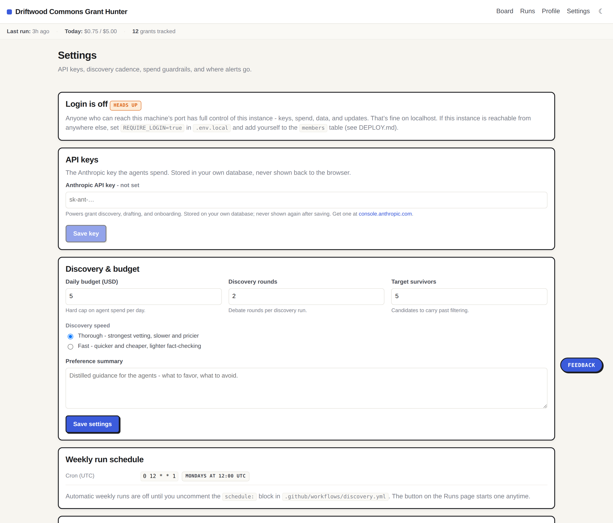
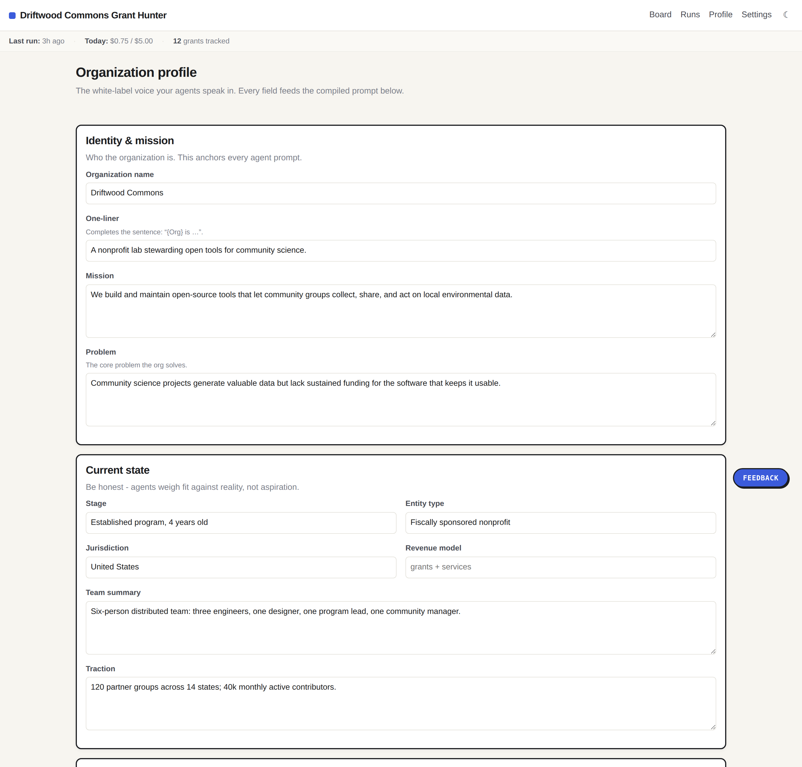

# Grant Hunter

**A white-label, self-hosted grant discovery + application assistant.** Clone it, run one setup command, fill in your org profile, and you get:

- A **dashboard** pipeline board (Searched / Working on / Submitted / Closed) with the full agent debate transcript on every grant.
- **Adversarial agents** that discover grants (Finder → Skeptic → Judge) and draft applications (Drafter ⇄ Critic) - agents that argue *against* each other so weak matches get killed before they reach you.
- A **teaching loop** - rate suggestions by number *and* freeform text; future runs learn from it.
- Digests, deadline reminders, and draft-ready alerts to the **channel of your choice** - Slack, Discord, Telegram, or email (pick any, or several).
- An **org profile** (mission, capabilities, ethos, eligibility) that drives everything. Nothing about any organization is hardcoded - you fill it in during onboarding.

This is the open-source, productized successor to a single-org grant bot. It reuses a grant-research engine already proven in production and strips out everything org-specific so **any** org can run their own instance.



## How you run it

Each organization runs its own private copy. You clone the
repo, plug in your own accounts (Supabase for the database, an Anthropic key for the
AI, plus any notification channels you want), and run it. 

You can run the whole thing from your own computer - three commands, then the browser
walks you through the rest:

```bash
git clone https://github.com/renaobrien/Grant-Hunter grants
cd grants
npm install
npm run dev        # open http://localhost:3000
```

The app takes it from there, in your browser:

1. **Connect your database** - a guided page asks for your (free) Supabase project's ref
   and two keys, tests the connection, and even hands you the SQL to create the tables.
2. **Onboarding** - tell it about your org (or paste your website and let it fill the form).
3. **Find grants** - hit **Run discovery now** on the board. Done.

Notes: the `git clone` needs **no GitHub login or password** (public repo). If you see
`next: command not found`, you skipped `npm install`. Prefer no Git? Download the ZIP from
GitHub instead - **[SETUP.md](SETUP.md)** has the full walkthrough, plus an optional
CLI path for terminal fans.

After that, start it with:

```bash
npm run dev        # dashboard at http://localhost:3000
```

Run discovery from the board or Runs page. Keys, notification channels, the run
schedule, and app updates all live under **Settings**.

Running locally, it opens **straight to the dashboard - no login** (a sign-in wall on your
own machine is just friction).

Want login anyway? It's one setting: add `REQUIRE_LOGIN=true` to `.env.local` and restart,
and you get magic-link sign-in gated by a members allowlist. Hosting publicly? You should
turn it on - see [DEPLOY.md](DEPLOY.md).

Want it always online instead of on your laptop, so sign-in works from your phone and
grants get found even when your computer is off? Host it in ~15 minutes on Vercel (free
tier): **[DEPLOY.md](DEPLOY.md)**. You paste the Supabase values into the host's UI, so
there's no `npm run setup` and no `.env.local` at all.

## What it looks like

Everything below is the stock UI with the built-in demo data (`npm run seed:demo`) and a
fictional org profile - your instance shows your own name and brand colors instead.

**Grant detail - every grant carries its adjudication debate.** The Finder's claim, the
Skeptic's attempt to kill it, and the Judge's ruling are all on the record:



**Application drafts - the Drafter ⇄ Critic loop.** Drafts aren't accepted until the
Critic signs off, and the critique rounds stay attached:



**Runs - every agent invocation, costed.** Tokens, duration, and dollars per step, plus
the candidates that were cut before reaching the board and why. What each agent runs on
and what it costs: [docs/AGENTS.md](docs/AGENTS.md).



**Settings - keys, budgets, cadence, and channels**, all in the browser. The Anthropic key
and channel secrets are write-only; the per-run and daily budget caps are hard stops:



**Org profile - the white-label core.** Every field feeds the compiled prompt the agents
speak in; swap this record and the same code works for a different organization:



## What it costs to run

You bring your own accounts and pay your own usage, there's no vendor in the middle. For a
typical low-volume org (one weekly discovery run), realistic monthly cost is **≈ $0-15 plus
your Anthropic usage**:

| Service | What it's for | Cost |
|---|---|---|
| **Anthropic API** | The agents' Claude calls (the actual work) - Opus for the adversaries/drafter, Sonnet for search, plus web search | Pay-as-you-go. A weekly discovery run is typically **a few dollars/month**. Three ceilings keep it there: a **per-run budget** (default $2) and a **daily budget cap** (default $5), both under Settings, plus the **monthly usage limit** you should set on the key at [console.anthropic.com/settings/limits](https://console.anthropic.com/settings/limits) - that one is enforced by Anthropic itself, so your bill stays capped even if the app misbehaves. |
| **Supabase** | Postgres database + magic-link auth | **Free tier** covers this comfortably (2 free projects per org). A dedicated **paid project is ~$10/mo** if you're past the free tier or want it isolated. |
| **Vercel** | *(optional)* hosts the dashboard so it's reachable beyond `localhost` | **Free** (Hobby tier). |
| **GitHub Actions** | *(optional)* runs discovery + the jobs worker on a schedule - no server to keep alive | **Free** tier minutes cover it easily. |
| **Resend** (optional, email) | Email digests | **Free** tier = 100 emails/day. |
| **Slack / Discord / Telegram** (optional) | Digests + alerts | **Free** (just a webhook or bot token). |

Every agent call is logged to `agent_runs` with tokens, web-search count, and estimated cost,
so you can see exactly what you're spending on the dashboard's Runs page.

## Stack

- **Next.js** (App Router) + **Supabase** (Postgres + Auth) - Supabase is just your database and login; no Deno / Edge Functions to manage.
- The **agent engine is plain Node/TypeScript** (`engine/`, run via `tsx`) - run it yourself with `npm run discover` / `npm run jobs`, or, optionally, let a **GitHub Actions cron** run it on a schedule for you (off by default; turn it on in SETUP.md). No server to keep alive either way.
- **Claude** (latest models) with web search. Notifications fan out to Slack / Discord / Telegram (bot API) / email (**Resend**) via one dispatcher.

## Layout

```
engine/                  the agent engine (Node/TS)
  types.ts               shared types
  render-profile.ts      profile row -> system prompt (the white-label core) + agent role blocks
  anthropic.ts           Claude wrapper (@anthropic-ai/sdk) + cost estimation + JSON salvage
  preference-context.ts  the teaching loop (numeric + freeform -> prompt context)
  db.ts                  service-role Supabase access, budget cap, run logging, grant upsert
  notify.ts              one dispatcher -> Slack / Discord / Telegram / email
  agents/                finder.ts, skeptic.ts, judge.ts, drafter.ts, critic.ts
  discovery.ts           orchestrator: N rounds of Finder -> Skeptic -> Judge
  draft.ts               Drafter <-> Critic narrative loop
  run-discovery.ts       entrypoint: weekly discovery + digest
  run-jobs.ts            entrypoint: drain draft jobs + sweep deadlines (every 30 min)
.github/workflows/
  discovery.yml          weekly cron (Mondays) - discovery
  jobs.yml               */30 cron - drafting jobs + deadline reminders
supabase/migrations/     SQL schema + RLS (single-org; applied by `npm run db:push`)
app/                     Next.js dashboard (board, grant detail, profile, settings, runs)
lib/ components/         dashboard supabase clients, types, shared UI
scripts/                 setup + onboarding (guided, interactive)
examples/                sample org profiles (reference only - not applied)
```

## Who can access it

This is a private tool for one organization. No sign-up, no other tenants.

- **Login is off by default** for local use - you just open the app. Turn it on with `REQUIRE_LOGIN=true` (recommended when hosting publicly).
- **With login on**, people sign in with a magic link, but only if their email is on your **members allowlist** (you choose who's on it). That's enforced in the database itself (Row-Level Security), not just hidden in the UI.
- **The agents** (discovery, drafting, deadline sweeps) run in the background with a privileged server key, so they keep working regardless of who's logged in.

Everything the agents know about your org lives in one **profile** record you fill in during onboarding - mission, what you do, what you're eligible for, what to avoid. Every agent reads that record before it acts. Swap the profile and the exact same code runs for a completely different organization - that's what makes it white-label.

## Safety

Spend is bounded at three levels, all enforced in code (`engine/discovery.ts`,
`engine/anthropic.ts`):

- **Per run** (`settings.run_budget_usd`, default $2): a run stops starting new debate
  rounds once its spend reaches this. A started round always finishes, so paid-for
  searches become judged results instead of waste.
- **Per day** (`settings.daily_budget_usd`, default $5): before every Finder/Skeptic
  call, discovery checks that a *worst-case* call still fits in what's left of the day -
  not just that the budget isn't already spent. Drafting checks before each
  Drafter/Critic round (`engine/draft.ts`).
- **Per month**: the usage limit you set on your own key at
  [console.anthropic.com/settings/limits](https://console.anthropic.com/settings/limits),
  enforced by Anthropic itself.

The ledger the caps read can't be fooled by failures: every agent call is recorded in
`agent_runs` with tokens, web searches, and cost, and a call that dies without usage data
(timeout, network, 5xx) is billed a conservative worst-case floor instead of nothing.
Individual API calls are bounded too - small web-search budgets, a 6-minute request
timeout, one retry, and an abort signal tied to the run's 40-minute wall clock. Grant
links are fetched and verified before a grant reaches your board, so dead 404 pages get
cut. Since you use your own API key, a runaway only ever touches your own bill - and the
caps stop it first. Per-agent models and costs: [docs/AGENTS.md](docs/AGENTS.md).

### Caveats over silent kills

The agents never quietly eat a borderline grant - uncertainty comes to you, with a
warning, so your rating trains the system:

- **"Verify first" chip** on a board card means the agents weren't sure (low confidence,
  or an open blocker like "confirm entity type"). Hover it for the exact question; the
  full reasoning is on the grant's detail page.
- **Profile gaps banner** on the board and Runs page appears when your profile is
  missing entity type or jurisdiction - funders decide eligibility on exactly those, so
  candidates carry blockers until you fill them in under Profile.
- **A blocked Start button explains itself** (budget spent, headroom too small) instead
  of silently doing nothing. The Spend panel warns from 75% of the daily budget.
- Agent rejections **expire when you edit your profile** (old verdicts were made against
  an older org description). Your own actions don't: rating a grant 1-2 keeps it off the
  board, and **Delete** (on the grant page) removes it permanently - discovery will
  never re-propose a deleted grant.

## Roadmap

What's next, in priority order - cost-per-survivor metrics, persisted cull memory, run
summaries where you look, ledger reconciliation, and more: [docs/ROADMAP.md](docs/ROADMAP.md).
